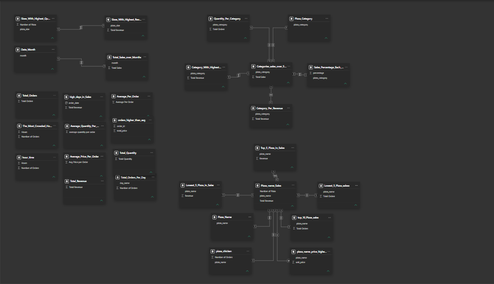
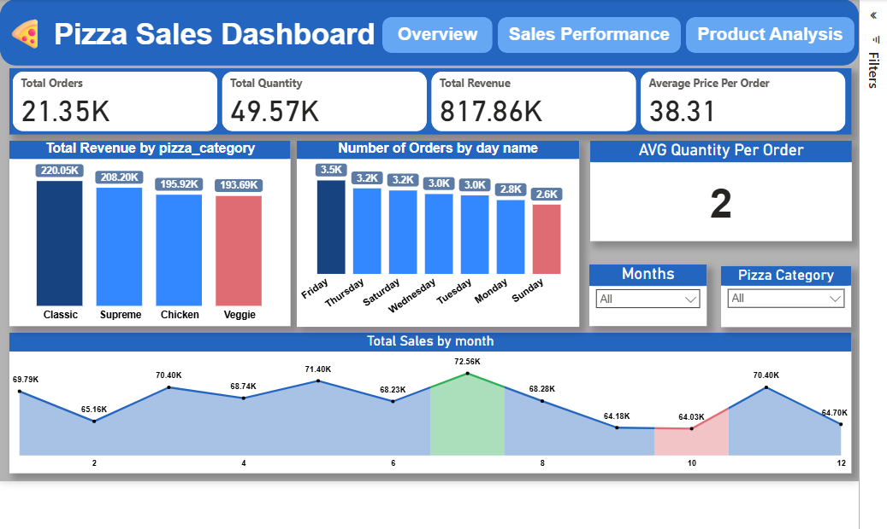
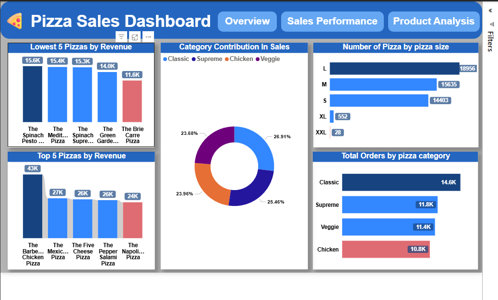
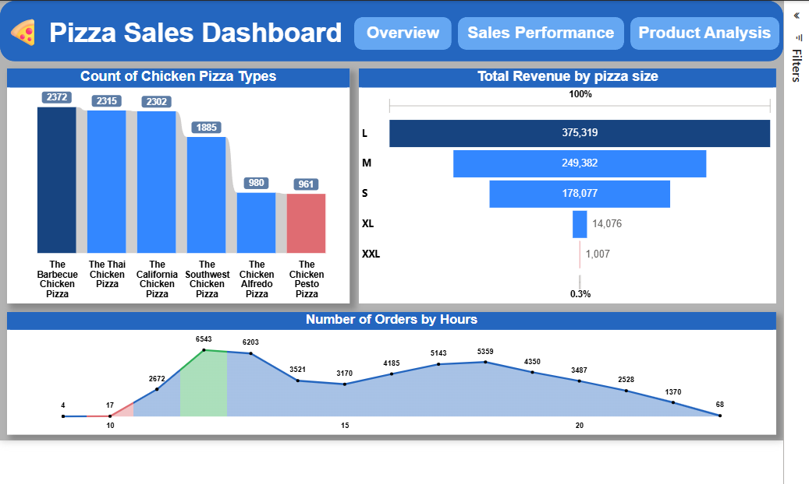

#  Pizza Sales Analytics Dashboard

##  Project Overview
An interactive sales analytics dashboard built using SQL and Power BI to analyze pizza sales performance, revenue trends, customer ordering behavior, and product insights.

The project focuses on transforming raw sales data into actionable business insights through:
- SQL data analysis
- KPI reporting
- Sales trend monitoring
- Product performance analysis
- Interactive Power BI dashboards

---

#  Business Objectives
- Monitor total sales performance
- Analyze revenue trends over time
- Identify top-selling and low-performing pizzas
- Compare pizza categories and sizes
- Understand customer ordering patterns
- Evaluate operational sales performance

---

# 🛠️ Tools & Technologies
- SQL
- Power BI
- DAX
- Data Modeling
- Data Visualization

---

#  Data Analysis Workflow

## SQL Data Analysis
Used SQL queries for:
- Revenue calculations
- Order analysis
- Product aggregation
- Sales trend extraction
- Category performance analysis
- KPI generation

---

## Power BI Dashboard Development
Built interactive dashboards to visualize:
- Revenue performance
- Order behavior
- Product analysis
- Sales distribution
- Monthly sales trends

---

#  Key KPIs
- Total Orders
- Total Quantity Sold
- Total Revenue
- Average Price Per Order
- Average Quantity Per Order
- Revenue by Category
- Orders by Time
- Sales by Pizza Size

---

#  Dashboard Pages

## Overview
Provides a high-level overview of:
- Total revenue
- Total orders
- Monthly sales trends
- Revenue by pizza category
- Orders by weekday
- Average order metrics

---

## Sales Performance
Focused on:
- Revenue by pizza size
- Order distribution by hour
- Chicken pizza sales analysis
- Sales behavior by product size

---

## Product Analysis
Analyzes:
- Top 5 pizzas by revenue
- Lowest-performing pizzas
- Pizza category contribution
- Pizza size distribution
- Product-level sales performance

---

#  Key Insights
- Large-sized pizzas generated the highest revenue.
- Chicken pizzas represented strong sales performance.
- Sales volume peaked during afternoon and evening hours.
- Classic pizza category contributed the highest overall revenue.
- Certain low-performing pizzas generated significantly lower revenue compared to top products.

---

#  Recommendations
- Increase promotion of top-performing pizza categories.
- Optimize inventory for high-demand pizza sizes.
- Improve marketing strategies for lower-performing products.
- Focus operational resources during peak ordering hours.
- Introduce targeted offers based on customer ordering behavior.

---

#  Data Modeling
The project includes structured relationships and analytical measures for efficient reporting and KPI tracking.

## Data Model

---

#  Dashboard Preview

## Overview

---

## Sales Performance

---

## Product Analysis

---

#  Project Files
- SQL Queries (.sql)
- Power BI Dashboard (.pbix)
- Dashboard screenshots
- Data model
- DAX measures

---

#  Author
Ahmed Mohamed  
Pharmacist & Data Analyst | Power BI | SQL | Python | Healthcare Analytics

LinkedIn:
https://www.linkedin.com/in/ahmed-mohamed-data-analysis

GitHub:
https://github.com/ahmedmoham4d2003-dotcom
